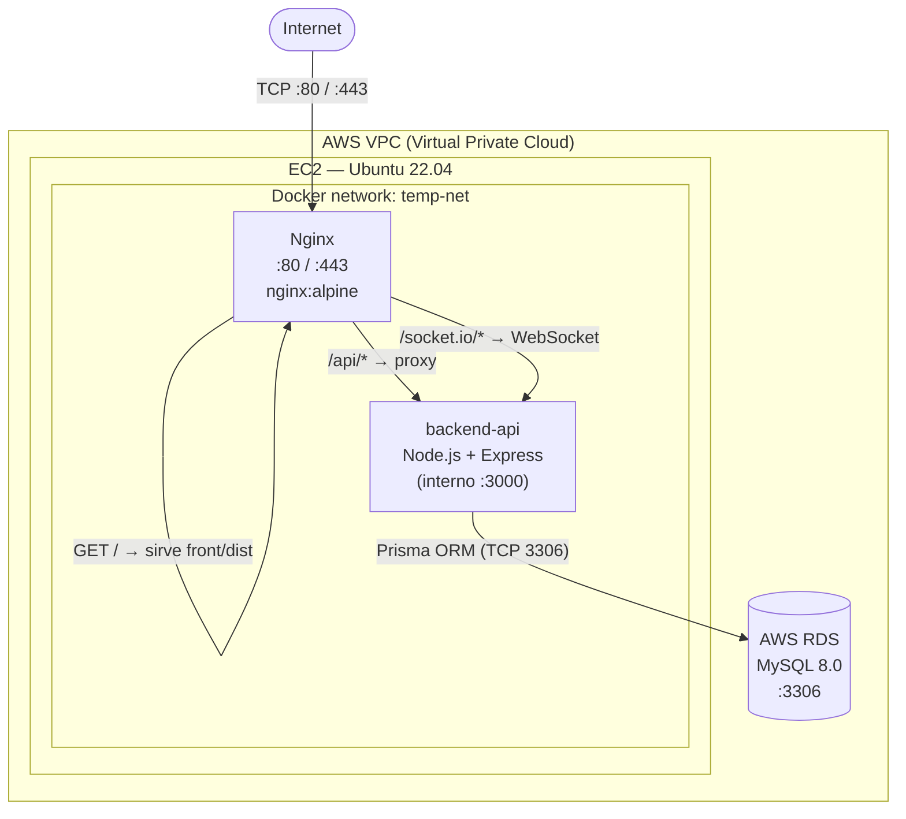

# Despliegue en EC2 — Proyecto Temp

Esta carpeta contiene la configuración necesaria para correr el proyecto en producción sobre una instancia **EC2 de AWS** con una base de datos administrada en **AWS RDS (MySQL)**. El stack de producción se compone de:

- **Frontend**: Servido por Nginx a partir de los estáticos compilados en el pipeline de CI/CD.
- **Backend**: Node.js + Express + TypeScript + Prisma ORM corriendo en un contenedor Docker.
- **Base de Datos**: AWS RDS (MySQL 8.0) administrado, garantizando backups y alta disponibilidad.
- **Reverse Proxy**: Nginx — sirve el frontend directamente y redirige peticiones de `/api/` y WebSockets (`/socket.io/`) al backend de Node.

---

## Estructura de esta carpeta

```
deploy/
├── docker-compose.prod.yml   # Orquesta Nginx y el backend en producción
├── nginx/
│   └── nginx.conf            # Configuración de Nginx: estáticos + proxy al backend + WebSockets
├── init-server.sh            # Script de setup inicial de la instancia EC2 (Docker + Swap de 2GB)
└── README.md                 # Este archivo con instrucciones
```

---

## Arquitectura en Producción



El puerto `3000` del backend **no está expuesto al exterior** — solo Nginx es público a través de los puertos `80` (HTTP) y `443` (HTTPS). El tráfico hacia la base de datos RDS ocurre de manera interna y segura dentro de la VPC.

---

## Cómo funciona cada archivo

### `docker-compose.prod.yml`

Orquesta los dos servicios que corren en la instancia EC2 dentro de una red interna `temp-net`:

| Servicio | Imagen | Puerto externo | Descripción |
|---|---|---|---|
| `nginx` | `nginx:alpine` | `80:80`, `443:443` | Reverse proxy + sirve el frontend compilado en producción |
| `backend-api` | Dockerfile local | solo interno `:3000` | API REST + WebSockets en Node.js |

**Arranque y Salud:**
1. El backend corre y expone su puerto `:3000` internamente.
2. Nginx arranca solo cuando el backend se encuentra saludable (validado a través del endpoint `/healthy` por medio de su healthcheck).

### `nginx/nginx.conf`

Divide el tráfico del servidor en tres bloques:

| Ruta | Comportamiento |
|---|---|
| `/` | Sirve archivos estáticos desde `../front/dist` (montado como volumen de solo lectura). `try_files` asegura que el router SPA funcione correctamente. |
| `/api/` | Proxy hacia `http://backend-api:3000` preservando headers de IP real del cliente. |
| `/socket.io/` | Proxy WebSocket con headers `Upgrade` + timeouts extendidos de 1 hora para conexiones continuas. |

### `init-server.sh`

Script de automatización para preparar la máquina virtual de AWS EC2. Se ejecuta **una sola vez** como root (`sudo`) e inicializa:

1. **`apt-get upgrade`** — actualiza el sistema base.
2. **SWAP de 2GB** — fundamental para evitar bloqueos por falta de memoria (Out-of-Memory / Error 137) al compilar dependencias en instancias pequeñas (`t3.micro` o `t3.small`).
3. **Docker Engine** — instala la última versión oficial de Docker, lo activa e incluye al usuario `ubuntu` en el grupo docker.
4. **Docker Compose** y estructura de directorios en `~/app/`.

---

## Flujo de Integración y Despliegue Continuo (CI/CD)

El repositorio cuenta con una automatización completa en `.github/workflows/deploy.yml` que elimina la necesidad de realizar commits de código compilado a Git o hacer pull manual. El flujo funciona de la siguiente manera en cada push a `main`:

```
[Push a main] ──> [GitHub Actions] ──> [Build Front con pnpm] ──> [Empacar tar.gz]
                                                                        │
[Levantar docker compose] <── [Extraer en EC2] <── [Subir por SCP] <────┘
```

1. **GitHub Actions** descarga los repositorios del backend y frontend de manera segura.
2. Descarga dependencias y compila los estáticos del frontend (`pnpm build`).
3. Empaqueta el backend y la carpeta compilada `dist` del frontend en archivos `.tar.gz`.
4. Transfiere de manera segura los paquetes comprimidos al EC2 usando SCP (`appleboy/scp-action`).
5. Con SSH (`appleboy/ssh-action`), extrae los paquetes en la máquina destino y ejecuta la reconstrucción de los contenedores Docker mediante `docker compose up -d --build`.

---

## Paso a Paso: Despliegue Completo en Producción

### 1. Prerrequisitos en AWS
* Una instancia EC2 con Ubuntu 22.04 LTS (se recomienda `t3.micro` o superior).
* Una instancia de base de datos **AWS RDS (MySQL 8.0)** activa.
* **Configuración de Security Groups (AWS Console):**
  * **EC2 Security Group:** Permitir `TCP 22` (SSH), `TCP 80` (HTTP) y `TCP 443` (HTTPS) de entrada desde el exterior.
  * **RDS Security Group:** Permitir `TCP 3306` (MySQL) de entrada. **Importante:** En el origen del tráfico, selecciona el ID del *Security Group de tu EC2* para autorizar únicamente la comunicación segura entre tus servidores.

### 2. Configurar los Secretos de GitHub
En tu repositorio de backend de GitHub, ve a **Settings > Secrets and variables > Actions** y añade los siguientes secretos de producción:

* `EC2_HOST`: IP pública o DNS de tu máquina EC2.
* `EC2_USER`: `ubuntu` (usuario por defecto en AWS Ubuntu).
* `EC2_SSH_KEY`: Clave privada SSH (.pem) completa para ingresar al servidor.
* `FRONT_REPO`: Nombre del repositorio de tu front (ej. `mi-usuario/temp-front`).
* `GH_PAT`: Token personal de GitHub (Personal Access Token) con permisos `repo` para descargar el front durante el build.

### 3. Preparación inicial del Servidor (EC2)
Conéctate a tu instancia EC2 por SSH por primera vez y ejecuta:

```bash
# 1. Clonar el repositorio del backend temporalmente
git clone <url_de_tu_repo_backend> ~/app/backend

# 2. Correr el script de configuración base
sudo bash ~/app/backend/deploy/init-server.sh

# 3. Cerrar sesión SSH y volver a entrar para aplicar cambios de grupo docker
exit
```

### 4. Configurar Variables de Entorno del Backend
Crea el archivo `.env` de producción dentro del EC2:

```bash
nano ~/app/backend/.env
```

Añade los valores correspondientes a tu infraestructura de AWS (especialmente la URL de conexión de RDS):

```env
DATABASE_HOST="<endpoint_rds>"
DATABASE_USER="<usuario_rds>"
DATABASE_PASSWORD="<password_rds>"
DATABASE_NAME="<nombre_db>"
DATABASE_URL="mysql://<usuario_rds>:<password_rds>@<endpoint_rds>:3306/<nombre_db>"
PORT=3000
NODE_ENV=production
TOKEN_SECRET_KEY="crea_una_frase_muy_larga_y_compleja_aqui"
TOKEN_ACCESS_TIME="8h"
TOKEN_REFRESH_TIME="7d"
```

### 5. Primer Despliegue Automático
Una vez completado el setup anterior, cualquier cambio que subas a la rama `main` en tu repositorio local desencadenará el pipeline de GitHub Actions, construyendo el frontend y desplegando toda la aplicación automáticamente en tu instancia de EC2 de forma limpia y transparente.

---

## Comandos Útiles de Administración en el EC2

Una vez en el EC2, puedes conectarte y administrar los contenedores de producción usando Docker Compose en la carpeta del proyecto (`~/app/backend`):

```bash
# Ver el estado de salud de los servicios corriendo
docker compose -f deploy/docker-compose.prod.yml ps

# Ver los logs del backend en tiempo real
docker logs temp-backend --follow

# Ver los logs del proxy Nginx
docker logs temp-nginx --follow

# Forzar una reconstrucción manual del backend
docker compose -f deploy/docker-compose.prod.yml up -d --build backend-api

# Reiniciar servicios sin downtime o recargar Nginx ante cambios de nginx.conf
docker exec temp-nginx nginx -s reload

# Detener los servicios en producción
docker compose -f deploy/docker-compose.prod.yml down
```
