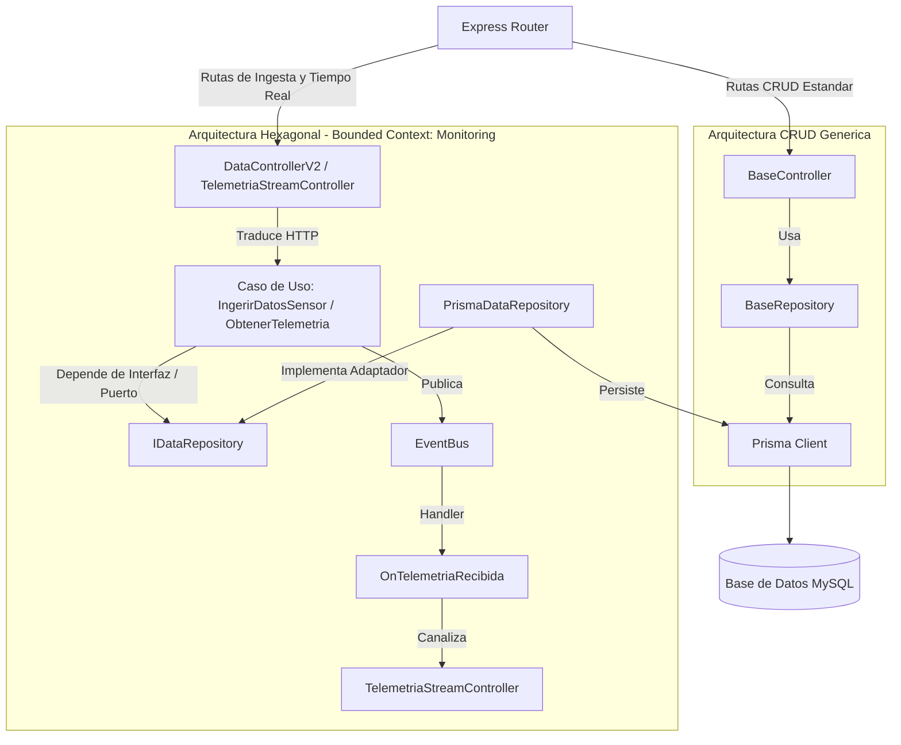
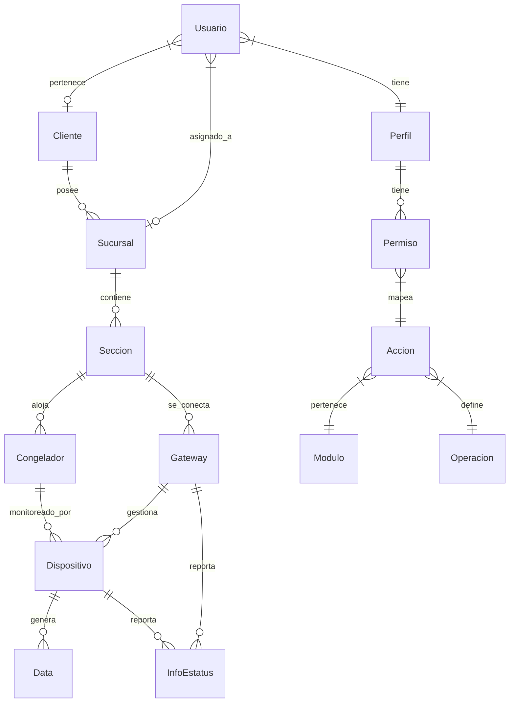
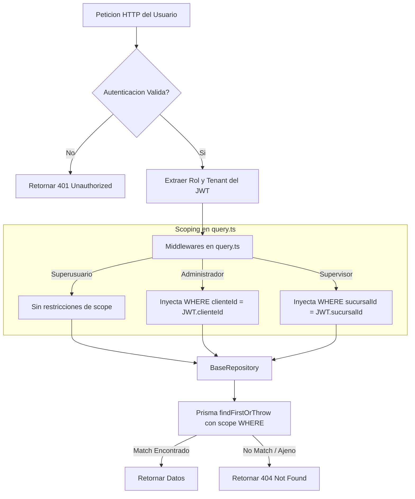
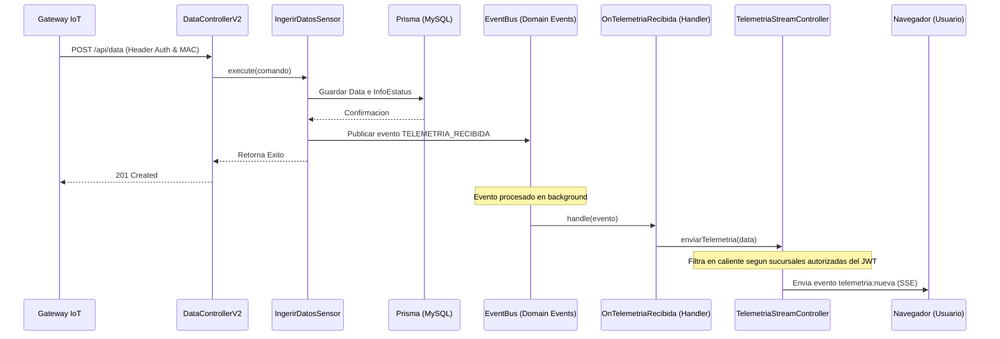

# Documentacion de Arquitectura y Decisiones Tecnicas - Backend

Este documento detalla la arquitectura, el diseño del modelo de datos, los mecanismos de seguridad, el sistema en tiempo real y las decisiones tecnicas del backend del Proyecto Temp.

---

## 1. Stack Tecnologico

El backend esta diseñado como una API REST robusta y modular, construida sobre el siguiente stack de tecnologias:

*   **Runtime**: Node.js 22
*   **Lenguaje**: TypeScript
*   **Framework Web**: Express
*   **ORM**: Prisma Client (definido en `prisma/schema.prisma`)
*   **Base de Datos**: MySQL / MariaDB (usando el adaptador `@prisma/adapter-mariadb` en produccion)
*   **Autenticacion**: JSON Web Tokens (JWT) con `jsonwebtoken` y encriptacion hashing con `bcryptjs`
*   **Validacion de Esquemas**: Zod para la validacion estricta en runtime de peticiones de entrada
*   **Tareas Programadas**: Node-cron para la ejecucion de reportes diarios
*   **Envio de Correos**: Nodemailer para la entrega de reportes en formato adjunto de correo electronico
*   **Generacion de Documentos**: ExcelJS para la construccion de reportes de hoja de calculo dinamicos en memoria
*   **Testing**: Vitest para ejecucion ultrarrapida de pruebas unitarias y de integracion, junto con Supertest para endpoints HTTP
*   **Gestion de Paquetes**: pnpm

---

## 2. Hibridez Arquitectonica: CRUD Estandar vs. Domain-Driven Design (DDD)

El sistema implementa una arquitectura hibrida que permite la coexistencia de dos patrones de desarrollo segun la complejidad y criticidad de los modulos:

### A. Lado CRUD Estandarizado (Administracion)
Para las entidades administrativas convencionales (ej. `Accion`, `Modulo`, `Operacion`, `Perfil`, `Cliente`, `Sucursal`, `Seccion`), se utiliza un diseño generico basado en clases base:
*   `src/models/BaseRepository.ts`: Encapsula las operaciones comunes de Prisma (count, findMany con paginacion y filtros, findFirst, create, update), inyectando el schema de seleccion y manejando implicitamente filtros de seguridad.
*   `src/controllers/base.ts`: Implementa los metodos CRUD estandar (obtenerElementos, crearElemento, obtenerElemento, editarElemento) y valida la entrada a traves de validadores pasados por parametro.
*   **Ventaja**: Reduce la duplicidad de codigo para catalogos simples, permitiendo crear endpoints completos de administracion de forma rapida y homogenea.

### B. Lado Domain-Driven Design (DDD) & Clean Architecture (Bounded Context: Monitoring)
Las funcionalidades principales y criticas para el negocio (ingesta de datos de sensores y transmision de telemetria en tiempo real) se encuentran en el Bounded Context `Monitoring` en `src/modules/monitoring`. Este modulo sigue la Arquitectura Hexagonal:
1.  **Dominio (`domain`)**: Contiene las reglas del negocio, entidades puras y las interfaces (puertos) como `IDataRepository` en `domain/repositories.ts`. No depende de Express ni de Prisma.
2.  **Aplicacion (`application`)**: Orquesta el flujo mediante Casos de Uso independientes como `IngerirDatosSensor.ts` y handlers de eventos como `OnTelemetriaRecibida.ts`.
3.  **Infraestructura (`infrastructure`)**: Detalles tecnicos como controladores Express v2, adaptadores Prisma (implementaciones de la interfaz de persistencia de dominio) y transmision Server-Sent Events (SSE).

**Por que se tomo esta decision?**
*   **Aislamiento del Core**: La ingesta de datos IoT y el streaming de eventos en vivo representan el nucleo de valor de la aplicacion. Aislarlo evita que los cambios en las herramientas de persistencia o el framework web rompan la logica del negocio.
*   **Desacoplamiento tecnologico**: Permite cambiar la tecnologia de tiempo real (por ejemplo, de WebSockets a SSE) sin modificar la logica del caso de uso de ingesta `IngerirDatosSensor`. Solo se modifico el handler de eventos `OnTelemetriaRecibida`.

---

## 3. Modelo de Datos y Estructura de la Base de Datos

El diseño de datos definido en `prisma/schema.prisma` se estructura bajo relaciones multi-tenant para organizar de forma logica la red de sensores:

### A. Jerarquia Multi-tenant y Estructura Organizativa
*   `Cliente`: Empresa corporativa principal.
*   `Sucursal`: Ubicaciones fisicas independientes asociadas a un cliente.
*   `Seccion`: Areas fisicas dentro de una sucursal (ej. Cocina, Almacen).
*   `Congelador`: Muebles de frio ubicados en una seccion. Cada congelador tiene una `temperaturaObjetivo` para calcular desviaciones.
*   `Dispositivo`: Modulo de adquisicion de datos fisico (sensor) instalado en un congelador y enlazado a un Gateway.

### B. Ingesta IoT e Historial de Mediciones
*   `Gateway`: Concentrador fisico de telemetria que recibe mediciones locales de los sensores y las sube al backend via REST. Posee un identificador unico (MAC) y un token criptografico (`tokenHash`).
*   `Data`: Tabla historica de alta frecuencia donde se registran la temperatura del congelador, la temperatura ambiente y la humedad (opcional). Cuenta con un indice compuesto `[idDispositivo, creado]` para acelerar las busquedas temporales.
*   `InfoEstatus`: Bitacora de estado fisico de los sensores (bateria, rssi, snr). Utiliza un indice compuesto analogo para graficas de diagnostico de red.
*   `ResumenDiario`: Tabla de agregados diarios que consolida las estadisticas de temperatura maxima, minima, media y mediana por sucursal y dia. Esto evita realizar escaneos masivos en tiempo de ejecucion para reportes basicos.

---

## 4. Seguridad y Control de Acceso

La seguridad esta integrada a nivel de enrutamiento, base de datos y control de flujo:

### A. Autenticacion Multi-canal para Usuarios
La autenticacion de usuarios se maneja mediante JWT firmado por una clave privada configurable en variables de entorno. 
*   **Header Authorization**: Metodo estandar para peticiones REST convencionales (`Authorization: Bearer <token>`).
*   **Query Parameter (`?token=`)**: Habilitado en `src/middlewares/autenticacion/strategies/tokenAutenticadorStrategy.ts` para soportar la conexion inicial de Server-Sent Events (SSE), dado que la API nativa de navegadores `EventSource` no permite cabeceras HTTP personalizadas de forma directa.

### B. Aislamiento de Inquilinos (Preveniendo IDOR)
Para mitigar fallas del tipo IDOR (Insecure Direct Object Reference), el backend aplica dos capas de defensa:
1.  **Inyeccion automatica de Tenant en la Creacion**: En `src/controllers/base.ts`, el metodo `inyectarTenant` extrae el `idCliente` y el `idSucursal` del JWT autenticado del usuario e invalida cualquier valor enviado en el cuerpo del JSON antes de guardarlo en la persistencia.
2.  **Scoping automatico de Consulta por Middlewares de Filtros**: El archivo `src/middlewares/query.ts` intercepta las peticiones y sobreescribe el parametro `where` del ORM segun el perfil del usuario autenticado:
    *   *Administrador de Cliente*: Sus filtros quedan restringidos automaticamente a registros que pertenezcan a su `idCliente`.
    *   *Supervisor de Sucursal*: Restringe las busquedas a su `idSucursal` especifico.
    *   *BaseRepository*: Cuando se lee o actualiza un registro individual por su identificador (`id`), el repositorio ejecuta internamente un `findFirstOrThrow` inyectando el scoping del usuario. Si el registro existe pero no pertenece a su tenant, la base de datos lanza una excepcion y el servidor retorna un error 404 (evitando confirmar la existencia de registros ajenos).

### C. Restriccion de Perfil Jerarquica
Para evitar escalamiento de privilegios, el middleware `QueryUsuariosMiddleware` implementa un control jerarquico en `src/middlewares/query.ts`:
*   Los perfiles tienen identificadores fijos (1: Superusuario, 2: Administrador, 3: Supervisor).
*   Un Administrador solo puede consultar o alterar usuarios con un perfil de ID mayor o igual al suyo (2 o 3), impidiendo ver o editar perfiles de Superusuario.
*   Un Supervisor solo puede ver otros Supervisores dentro de su sucursal.

### D. Autenticacion Segura de Gateways IoT (API Keys)
La ingesta masiva de datos desde gateways fisicos instalados en sucursales requiere un esquema de seguridad robusto:
1.  **Cero Almacenamiento en Texto Plano**: Al generar una clave para un gateway mediante `POST /api/gateways/:id/token`, el backend genera bytes aleatorios criptograficamente seguros y guarda unicamente su hash SHA-256 (`tokenHash`) en la base de datos.
2.  **Validacion del Gateway y Anti-Spoofing**: En `src/middlewares/autenticacion/autenticacionGateway.ts`, el middleware:
    *   Extrae el token Bearer, calcula su hash SHA-256 y busca el gateway asociado en base de datos.
    *   Verifica que el gateway este activo (`estatus = true`).
    *   Compara que el `identificador` enviado en el cuerpo JSON de la telemetria (MAC del gateway) coincida exactamente con el gateway al que pertenece el tokenHash. Esto previene que un gateway comprometido o un atacante envie mediciones haciendose pasar por otra MAC de gateway.

---

## 5. Monitoreo en Tiempo Real: Server-Sent Events (SSE)

El backend utiliza **Server-Sent Events (SSE)** en lugar de WebSockets para la distribucion de telemetria en tiempo real a los navegadores web de los usuarios.

### Por que se selecciono SSE frente a WebSockets?
*   **Unidireccionalidad Nativa**: El flujo de telemetria es puramente del servidor al cliente. SSE se ajusta a este patron.
*   **Simplicidad del Protocolo**: Corre sobre HTTP convencional. No requiere configuraciones de handshake complejas en proxies, Nginx o balanceadores de carga.
*   **Resiliencia Integrada**: Los navegadores web manejan de forma nativa la reconexion automatica de SSE si la red se interrumpe, enviando la cabecera `Last-Event-ID` de forma transparente.
*   **Eficiencia de Recursos**: Consume menos recursos de memoria en el servidor en comparacion con los frameworks de sockets bidireccionales.

### Arquitectura de Eventos Desacoplada
El flujo de emision en tiempo real aprovecha el patron **Event Driven Architecture** en el modulo `Monitoring`:

1.  **Emision de Eventos de Dominio**: Tras validar y persistir las lecturas, el caso de uso `IngerirDatosSensor` despacha en segundo plano un evento `TelemetriaRecibida` al `EventBus` global.
2.  **Suscripcion Desacoplada**: El handler `OnTelemetriaRecibida.ts` recibe la notificacion y la canaliza a `TelemetriaStreamController`.
3.  **Filtrado en Caliente de Multi-tenancy**: El `TelemetriaStreamController` mantiene en memoria el listado de conexiones activas. Para cada conexion, almacena la lista de `sucursales` autorizadas (resuelta a partir del JWT al momento de la conexion). Cuando llega una nueva lectura:
    *   Itera los clientes conectados.
    *   Verifica si el usuario es Superusuario o si la sucursal de la lectura esta incluida en la lista de sucursales autorizadas del cliente.
    *   Si es asi, envia el payload serializado mediante el evento `telemetria:nueva`. Esto garantiza que ningun cliente reciba datos en tiempo real de sucursales ajenas.
4.  **Heartbeat (Ping) de Conexion**: Cada 15 segundos, el servidor envia un comentario vacio (`:\n\n`) a todas las conexiones abiertas para mantener activos los sockets y evitar que los intermediarios de red cierren el canal por inactividad.

---

## 6. Trabajos Programados y Generacion de Reportes

El backend gestiona la programacion y distribucion de reportes analiticos a traves de tareas en segundo plano.

### A. Programacion Horaria Eficiente
El modulo `src/jobs/reporteDiario.ts` inicializa un cron programado para ejecutarse en el minuto 0 de cada hora (`0 * * * *`).
*   **Optimizacion de Carga**: En lugar de calcular y enviar todos los reportes a medianoche saturando los recursos del servidor, la base de datos y la red, el sistema distribuye el envio de acuerdo a la preferencia horaria de cada cliente (`horaReporte` en la tabla `Cliente`).
*   **Filtro Dinamico**: Cada hora, el cron busca unicamente los clientes activos cuyo campo `horaReporte` coincida con la hora actual de la zona horaria configurada.

### B. Pre-calculo de Agregados para Evitar Degradacion de Base de Datos
Al procesar la tarea de una sucursal, el job invoca `ResumenDiarioModel.calcularYGuardar`. 
*   Este proceso calcula las agregaciones (temperatura maxima, minima, media y mediana, asi como total de lecturas) del dia anterior y las guarda en la tabla `ResumenDiario`.
*   Esto crea un punto de control optimizado. Si los usuarios descargan el historico de reportes recurrentemente desde la interfaz web, el sistema solo consulta la tabla `ResumenDiario` en lugar de escanear y calcular agregados sobre millones de lecturas de la tabla `Data`.

### C. Construccion de Excel y Entrega por Correo
*   **Generacion en Memoria**: El modulo `generarReporteExcel` de `exceljs` procesa los datos y los escribe en un buffer de memoria, evitando escribir archivos temporales en el disco duro del servidor.
*   **Resolucion de Destinatarios**: El job recopila de forma unificada los correos de todos los usuarios vinculados al Cliente corporativo y todos los usuarios asignados a la Sucursal especifica, deduplicandolos mediante un `Set` en JavaScript, garantizando que el personal correspondiente reciba las alertas diarias de temperatura.

---

## 7. Estrategia de Pruebas (Testing)

El backend cuenta con una suite de pruebas automatizadas ejecutadas bajo Vitest, garantizando la estabilidad frente a refactorizaciones:

1.  **Pruebas Unitarias en Dominio y Casos de Uso**: Ubicadas en `src/__tests__/unit`. Prueban la logica empresarial de los casos de uso (ej. `IngerirDatosSensor`) simulando el repositorio de datos mediante dobles de prueba (mocks). Esto asegura que las reglas de negocio sean correctas sin depender de la conexion a bases de datos o red.
2.  **Pruebas de Controladores e Integracion (Supertest)**: Verifican que la serializacion de payloads JSON, los codigos de estado HTTP y los middlewares de autenticacion y scoping funcionen de forma integrada en el pipeline de Express.
