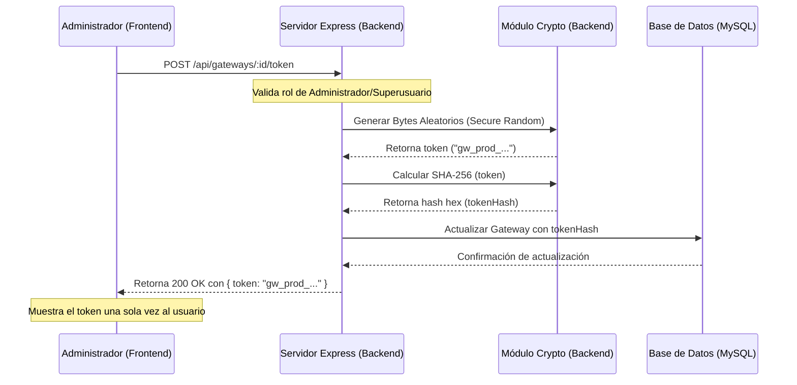

# Guía de Arquitectura: Autenticación de Gateways mediante API Keys

Este documento detalla la arquitectura de seguridad implementada en el sistema para asegurar la ingesta de telemetría proveniente de dispositivos de campo (Gateways IoT) a través del endpoint `/api/data`.

---

## 1. Fundamentos de Seguridad

Para garantizar un canal de comunicación confiable y mitigar ataques de suplantación de identidad (donde un agente externo inyecta mediciones falsas simulando ser un gateway legítimo), se implementa un **esquema dual de autenticación** para el endpoint `/api/data`:

1.  **Modo 1: Autenticación por Firma Digital (Recomendado/No Repudio)**: El Gateway firma criptográficamente cada payload de telemetría utilizando su clave privada ECDSA. El servidor valida la autenticidad usando la clave pública registrada, protegiendo contra el repudio de datos y ataques de repetición mediante un nonce temporal.
2.  **Modo 2: Autenticación Legacy por API Key (Bearer Token)**: El Gateway envía un token secreto estático. El servidor valida el hash SHA-256 del token contra el registrado en la base de datos.

### Políticas de Diseño
*   **No Repudio (Modo 1)**: Asegura la procedencia irrefutable del dato y la integridad del cuerpo del mensaje en tránsito.
*   **Mitigación de Replay Attacks (Modo 1)**: Mediante la cabecera `X-Gateway-Nonce` validada contra Redis con una ventana temporal de 5 minutos, se garantiza que ningún mensaje pueda ser interceptado e inyectado de nuevo.
*   **Sincronización de Reloj (Modo 1)**: Se implementa una ventana estricta de tolerancia de +/- 5 minutos (300,000 milisegundos) entre el timestamp del Gateway (`X-Gateway-Timestamp`) y el reloj del servidor.
*   **Hashing Unidireccional en Servidor (Modo 2)**: Para el modo legacy, el servidor no almacena las API Keys en texto plano en la base de datos. En su lugar, calcula el hash SHA-256 del token y lo almacena en el campo `tokenHash` del modelo `Gateway`.
*   **Privilegio Mínimo**: Ambos modos únicamente autorizan la escritura en el endpoint `POST /api/data` para los dispositivos asociados. No permiten lectura ni edición de otros recursos de la API.

---

## 2. Flujos de Trabajo (Arquitectura)

### A. Generación y Almacenamiento de Claves
El flujo desde que un administrador solicita la clave hasta que se almacena y se le muestra se detalla a continuación:



### B. Validación de Peticiones de Ingesta (Runtime)
El sistema divide la validación en dos middlewares independientes para separar limpiamente las responsabilidades de seguridad y facilitar la migración:

#### 1. Middleware de Firma Digital: `autenticarGateway`
Es el middleware activo por defecto para la ruta principal `/api/data`. Valida únicamente firmas criptográficas (No Repudio):

```mermaid
flowchart TD
    Start[Petición POST /api/data] --> CheckFields{¿Tiene body.identificador y<br>las 3 cabeceras completas?<br>(Signature, Timestamp, Nonce)}
    CheckFields -- No (Cabeceras vacías) --> Reject401[Retornar 401 Unauthorized<br>Firma digital requerida]
    CheckFields -- No (Parcialmente vacías) --> Reject400[Retornar 400 Bad Request]
    CheckFields -- Sí --> VerifyTime{¿Timestamp dentro de tolerancia<br>+/- 5 minutos?}
    VerifyTime -- No --> RejectExpired[Retornar 401 Unauthorized<br>Petición expirada]
    VerifyTime -- Sí --> GetGW[Buscar Gateway por identificador]
    GetGW -- No existe / Inactivo --> RejectGW[Retornar 401 Unauthorized]
    GetGW -- Activo --> CheckNonce{¿Nonce único en Redis?}
    CheckNonce -- Duplicado --> RejectReplay[Retornar 401 Unauthorized<br>Nonce ya utilizado]
    CheckNonce -- Único --> CheckPubKey{¿Tiene publicKeyPem registrado?}
    CheckPubKey -- No --> RejectNoKey[Retornar 401 Unauthorized]
    CheckPubKey -- Sí --> VerifyCrypto{Verificar Firma ECDSA SHA-256<br>Msg: bodyString | timestamp | nonce}
    VerifyCrypto -- Inválida --> RejectSig[Retornar 401 Unauthorized<br>Firma inválida]
    VerifyCrypto -- Válida --> SaveSig[Guardar req.gateway y req.firmaGateway] --> Next1[next]
```

#### 2. Middleware Legacy: `autenticarGatewayLegacy`
Creado para dar soporte a dispositivos legados en campo que aún no soportan criptografía asimétrica ni sincronización NTP:

```mermaid
flowchart TD
    Start[Petición POST /api/data (Legacy)] --> MatchHeaders{¿Tiene Authorization Bearer<br>y body.identificador?}
    MatchHeaders -- No --> Reject401[Retornar 401 Unauthorized<br>Credenciales incompletas]
    MatchHeaders -- Sí --> HashToken[Calcular SHA-256 del Token]
    HashToken --> GetGW2[Buscar Gateway por tokenHash]
    GetGW2 -- No existe / Inactivo --> RejectGW2[Retornar 401 Unauthorized]
    GetGW2 -- Activo --> MatchMAC{¿Coincide body.identificador<br>con gateway.identificador?}
    MatchMAC -- No --> RejectMAC[Retornar 401 Unauthorized]
    MatchMAC -- Sí --> SaveGW2[Guardar req.gateway] --> Next2[next]
```

---

## 3. Detalles de Implementación en Código

### A. Estructura de Datos (Prisma)
Se agregaron campos para el soporte criptográfico (`publicKeyPem`) y el encadenamiento de integridad de datos en el modelo `Gateway` y `Data` (`prisma/schema.prisma`):

```prisma
model Gateway {
  id            Int           @id @default(autoincrement())
  identificador String        @unique // MAC o ID único de hardware
  nombre        String
  tokenHash     String?       @unique // Hash SHA-256 de la API Key (Modo Legacy)
  publicKeyPem  String?       @db.Text // Clave Pública para verificación ECDSA (Modo Firma)
  creado        DateTime      @default(now())
  actualizado   DateTime      @updatedAt
  estatus       Boolean       @default(true)
  idSeccion     Int
  seccion       Seccion       @relation(fields: [idSeccion], references: [id])
  dispositivos  Dispositivo[]
  infoEstatus   InfoEstatus[]
}

model Data {
  id            Int         @id @default(autoincrement())
  temperatura   Float
  ambiente      Float
  humedad       Float?
  creado        DateTime    @default(now())
  actualizado   DateTime    @updatedAt
  estatus       Boolean     @default(true)
  idDispositivo Int
  dispositivo   Dispositivo @relation(fields: [idDispositivo], references: [id])
  firmaGateway  String?     @db.Text   // Firma del gateway si se usó Firma Digital
  hash          String?     @db.VarChar(64) // Hash SHA-256 del registro para integridad (chaining)
  prevHash      String?     @db.VarChar(64) // Hash del registro anterior del dispositivo
  
  @@index([idDispositivo, creado])
}
```

### B. Middleware de Validación
El código se encuentra separado en:
1.  **Firma Criptográfica**: Implementado en [autenticacionGateway.ts](file:///home/idt/Projects/temp/temp-back/src/middlewares/autenticacion/autenticacionGateway.ts), exportando `autenticarGateway`.
2.  **API Key Legacy**: Implementado en [autenticacionGateway.legacy.ts](file:///home/idt/Projects/temp/temp-back/src/middlewares/autenticacion/autenticacionGateway.legacy.ts), exportando `autenticarGatewayLegacy`.

### C. Registro en Rutas
La ruta estándar `/api/data` utiliza el middleware moderno de firma digital en [index.ts](file:///home/idt/Projects/temp/temp-back/src/routes/index.ts):
```typescript
router.post("/api/data", autenticarGateway, dataControllerV2.crearElemento);
```

---

## 4. Gestión desde la Interfaz de Usuario (Frontend)

La administración de los Gateways y sus credenciales de seguridad se realiza desde el panel de **Gateways** (`front/src/modules/gateways/views/Gateways.vue`):

1.  **Monitoreo visual del estado**: La columna "Seguridad (Clave Pública)" muestra de forma clara mediante etiquetas si el dispositivo cuenta con una clave pública configurada (`Configurada` en verde) o si aún carece de ella (`Sin clave` en amarillo).
2.  **Registro de Clave Pública**: Al crear o editar un Gateway a través de [GatewaysForm.vue](file:///home/idt/Projects/temp/temp-front/src/modules/gateways/components/GatewaysForm.vue), se expone el campo **Clave Pública (PEM)** de tipo textarea. Aquí los administradores pueden pegar directamente el bloque de clave pública ECDSA generada para el dispositivo.
3.  **Depreciación de API Keys**: Se removieron todas las acciones de generación, visualización y eliminación de API Keys estáticas del panel de usuario, forzando el uso exclusivo de la autenticación por firma digital en los nuevos dispositivos.
