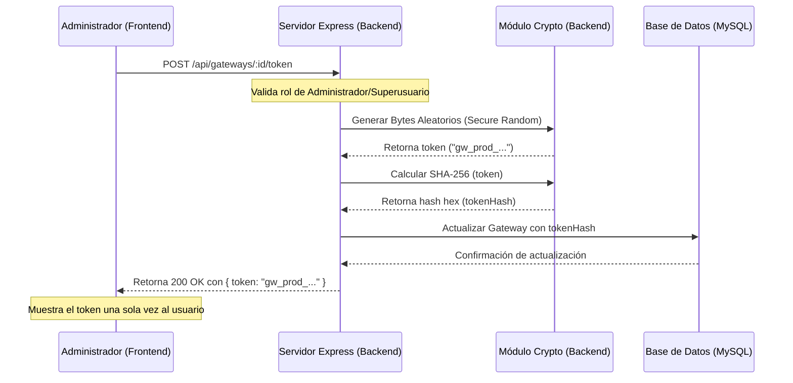
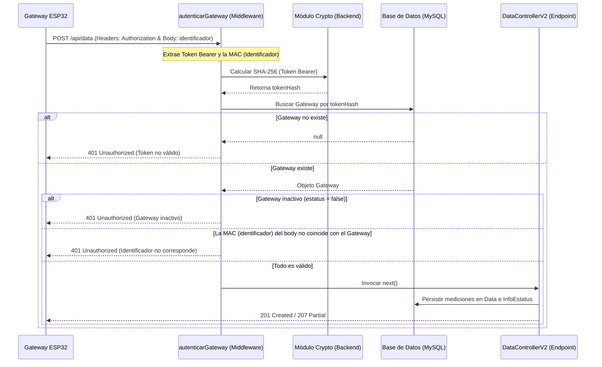

# Guía de Arquitectura: Autenticación de Gateways mediante API Keys

Este documento detalla la arquitectura de seguridad implementada en el sistema para asegurar la ingesta de telemetría proveniente de dispositivos de campo (Gateways IoT) a través del endpoint `/api/data`.

---

## 1. Fundamentos de Seguridad

Para garantizar un canal de comunicación confiable y mitigar ataques de suplantación de identidad (donde un agente externo inyecta mediciones falsas simulando ser un gateway legítimo), se ha implementado un esquema de autenticación por API Keys.

### Políticas de Diseño
*   **Sin expiración automática**: Las API Keys asignadas a dispositivos físicos no expiran automáticamente a corto plazo. Esto previene interrupciones abruptas en la ingesta y simplifica el mantenimiento en campo de los microcontroladores (ej: ESP32).
*   **Hashing Unidireccional en Servidor**: El servidor no almacena las API Keys en texto plano en la base de datos. En su lugar, calcula el hash SHA-256 de la API Key generada y lo almacena en el campo `tokenHash` del modelo `Gateway`. Ante una vulnerabilidad en la base de datos, las claves físicas de los dispositivos no se verán expuestas.
*   **Revocación Inmediata**: Cualquier administrador o superusuario del sistema puede revocar un token activo al instante, ya sea eliminando la clave o desactivando el gateway en el panel de control.
*   **Privilegio Mínimo**: El token asignado a un gateway únicamente tiene autorización para invocar el endpoint POST `/api/data` y escribir datos asociados a sus propios sensores. No otorga privilegios de lectura ni acceso a otras rutas de la API.

---

## 2. Flujos de Trabajo (Arquitectura)

### A. Generación y Almacenamiento de Claves
El flujo desde que un administrador solicita la clave hasta que se almacena y se le muestra se detalla a continuación:



### B. Validación de Peticiones de Ingesta (Runtime)
El flujo que ejecuta el middleware para cada petición de ingesta de telemetría:



---

## 3. Detalles de Implementación en Código

### A. Estructura de Datos (Prisma)
Se añadió el campo `tokenHash` único e indexado al modelo `Gateway` en `prisma/schema.prisma`:

```prisma
model Gateway {
  id            Int           @id @default(autoincrement())
  identificador String        @unique // MAC o ID único
  nombre        String
  tokenHash     String?       @unique // Hash SHA-256 del token
  creado        DateTime      @default(now())
  actualizado   DateTime      @updatedAt
  estatus       Boolean       @default(true)
  idSeccion     Int
  seccion       Seccion       @relation(fields: [idSeccion], references: [id])
  dispositivos  Dispositivo[]
  infoEstatus   InfoEstatus[]
}
```

### B. Middleware de Validación
Implementado en `backend/src/middlewares/autenticacion/autenticacionGateway.ts`. Realiza la extracción del token, cálculo de hash en tiempo constante para evitar ataques de temporización (timing attacks) y comprobación de estatus del dispositivo.

### C. Registro en Rutas
El endpoint POST `/api/data` se encuentra protegido por este middleware en `backend/src/routes/index.ts` antes de procesarse en `DataControllerV2`.

---

## 4. Gestión desde la Interfaz de Usuario (Frontend)

La administración de las API Keys se realiza desde el módulo de administración en la pestaña **Gateways** (`front/src/modules/gateways/components/GatewaysTabla.vue`).

### Funcionalidades de la interfaz
1.  **Monitoreo visual del estado**: Se muestra un tag visual que indica si el gateway cuenta con una clave activa (`Configurada` en verde) o si carece de ella (`Sin clave` en amarillo).
2.  **Generación Segura**: Al pulsar sobre "Generar", el frontend ejecuta la petición al servidor y abre un diálogo modal instructivo. Este diálogo muestra el token resultante una única vez y provee un botón de copiado rápido al portapapeles.
3.  **Revocación Controlada**: Al pulsar sobre "Eliminar", el frontend despliega un aviso de alerta a través de un diálogo de confirmación de Naive UI para prevenir la invalidación accidental de las claves operativas de los microcontroladores en campo.
