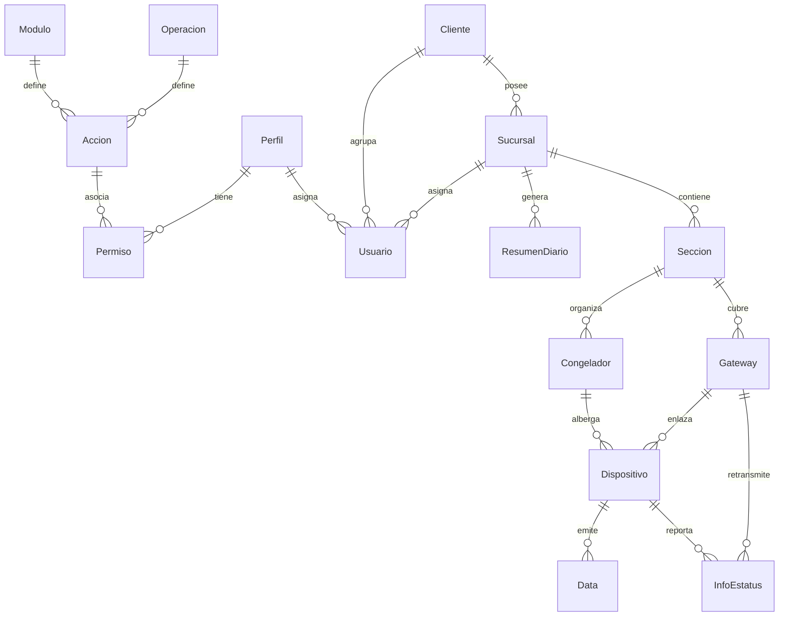

# Documentación del Esquema de la Base de Datos

Este documento describe la estructura, tablas, campos y relaciones de la base de datos utilizada en la aplicación. La base de datos es relacional (MySQL) y se gestiona mediante **Prisma ORM**.

El archivo de esquema principal se encuentra en [schema.prisma](../prisma/schema.prisma).

---

## 1. Diagrama Entidad-Relación (ER)

A continuación se muestra el diseño lógico de las tablas y cómo se relacionan entre sí:

---

## 2. Descripción de Modelos (Tablas)

La base de datos se divide principalmente en tres áreas funcionales: **Seguridad y Control de Acceso (RBAC)**, **Estructura Organizacional (Multi-tenant)**, y **Monitoreo y Telemetría**.

### Área A: Seguridad y Control de Acceso (RBAC)

#### Modulo
Almacena los diferentes módulos del sistema (ej. usuarios, congeladores, reportes) que requieren control de acceso.
* **id** (Int, PK, Autoincrement): Identificador único del módulo.
* **nombre** (String): Nombre descriptivo del módulo.
* **creado** (DateTime): Fecha y hora de creación del registro.
* **actualizado** (DateTime): Fecha y hora de última modificación.
* **estatus** (Boolean, default: true): Estado lógico (activo/inactivo).

#### Operacion
Define las acciones básicas o permisos genéricos sobre los recursos del sistema (ej. CREATE, READ, UPDATE, DELETE).
* **id** (Int, PK, Autoincrement): Identificador único de la operación.
* **nombre** (String): Nombre de la operación.
* **creado** (DateTime): Fecha y hora de creación.
* **actualizado** (DateTime): Fecha y hora de última modificación.
* **estatus** (Boolean, default: true): Estado lógico.

#### Accion
Es la intersección entre un `Modulo` y una `Operacion` que define una acción concreta ejecutable (ej. "Crear Sucursal").
* **id** (Int, PK, Autoincrement): Identificador único de la acción.
* **nombre** (String): Nombre amigable de la acción.
* **moduloId** (Int, FK): Relación con el módulo correspondiente.
* **operacionId** (Int, FK): Relación con la operación correspondiente.
* **creado** (DateTime): Fecha de creación.
* **actualizado** (DateTime): Fecha de modificación.
* **estatus** (Boolean, default: true): Estado lógico.

#### Perfil
Define los roles o perfiles del sistema (ej. Administrador, Empleado, Cliente).
* **id** (Int, PK, Autoincrement): Identificador único del perfil.
* **nombre** (String): Nombre del perfil.
* **creado** (DateTime): Fecha de creación.
* **actualizado** (DateTime): Fecha de modificación.
* **estatus** (Boolean, default: true): Estado lógico.

#### Permiso
Determina qué perfiles tienen acceso a qué acciones específicas del sistema.
* **id** (Int, PK, Autoincrement): Identificador único del permiso.
* **idPerfil** (Int, FK): Relación con el perfil.
* **idAccion** (Int, FK): Relación con la acción permitida.
* **creado** (DateTime): Fecha de creación.
* **actualizado** (DateTime): Fecha de modificación.
* **estatus** (Boolean, default: true): Estado de habilitación del permiso.

---

### Área B: Estructura Organizacional (Multi-tenant)

#### Cliente
Representa a la entidad corporativa u organización superior que contrata la plataforma.
* **id** (Int, PK, Autoincrement): Identificador único del cliente.
* **nombre** (String): Razón social o nombre comercial.
* **horaReporte** (Int, default: 0): Hora del día configurada para disparar los reportes automatizados.
* **creado** (DateTime): Fecha de creación.
* **actualizado** (DateTime): Fecha de modificación.
* **estatus** (Boolean, default: true): Estado lógico.

#### Sucursal
Sucursales o puntos de venta físicos que pertenecen a un `Cliente`.
* **id** (Int, PK, Autoincrement): Identificador único de la sucursal.
* **nombre** (String): Nombre de la sucursal.
* **idCliente** (Int, FK): Relación con el cliente propietario.
* **creado** (DateTime): Fecha de creación.
* **actualizado** (DateTime): Fecha de modificación.
* **estatus** (Boolean, default: true): Estado lógico.

#### Usuario
Almacena los datos de acceso e identificación de las personas usuarias del sistema.
* **id** (Int, PK, Autoincrement): Identificador único del usuario.
* **nombre** (String): Nombre.
* **apellido** (String): Apellido.
* **correo** (String, Unique): Dirección de correo electrónico (usada para login).
* **password** (String): Hash de contraseña.
* **idPerfil** (Int, FK): Relación con el perfil (rol).
* **idCliente** (Int, FK, Opcional): Relación con el cliente al que pertenece.
* **idSucursal** (Int, FK, Opcional): Relación con la sucursal asignada.
* **creado** (DateTime): Fecha de creación.
* **actualizado** (DateTime): Fecha de modificación.
* **estatus** (Boolean, default: true): Estado lógico.

#### Seccion
Divisiones o pasillos físicos dentro de una `Sucursal` (ej. Carnes, Lácteos, Congelados).
* **id** (Int, PK, Autoincrement): Identificador único de la sección.
* **nombre** (String): Nombre de la sección.
* **idSucursal** (Int, FK): Relación con la sucursal donde se ubica.
* **creado** (DateTime): Fecha de creación.
* **actualizado** (DateTime): Fecha de modificación.
* **estatus** (Boolean, default: true): Estado lógico.

---

### Área C: Monitoreo y Telemetría (IoT)

#### Congelador
Unidad física de congelación/refrigeración que requiere monitoreo térmico continuo.
* **id** (Int, PK, Autoincrement): Identificador único de la unidad.
* **nombre** (String): Nombre identificativo del congelador.
* **temperaturaObjetivo** (Float, default: -18.0): Límite óptimo de temperatura de conservación.
* **idSeccion** (Int, FK): Sección de la sucursal donde está ubicado.
* **creado** (DateTime): Fecha de creación.
* **actualizado** (DateTime): Fecha de modificación.
* **estatus** (Boolean, default: true): Estado lógico.

#### Gateway
Dispositivo concentrador (ej. LoRaWAN) que recibe las señales inalámbricas de los sensores instalados en la sección.
* **id** (Int, PK, Autoincrement): Identificador de base de datos.
* **identificador** (String, Unique): ID de hardware único del gateway.
* **nombre** (String): Nombre asignado al gateway.
* **tokenHash** (String, Unique, Opcional): Hash de la API Key utilizada para autenticar las peticiones de envío de datos.
* **idSeccion** (Int, FK): Sección en la que opera.
* **creado** (DateTime): Fecha de creación.
* **actualizado** (DateTime): Fecha de modificación.
* **estatus** (Boolean, default: true): Estado lógico.

#### Dispositivo
Sensor físico encargado de medir la temperatura y humedad en el congelador.
* **id** (Int, PK, Autoincrement): Identificador de base de datos.
* **nombre** (String): Nombre asignado.
* **identificador** (String, Unique): ID físico o dirección MAC única del sensor.
* **idGateway** (Int, FK): Gateway principal a través del cual reporta lecturas.
* **idCongelador** (Int, FK): Congelador físico en el cual está colocado el sensor.
* **creado** (DateTime): Fecha de creación.
* **actualizado** (DateTime): Fecha de modificación.
* **estatus** (Boolean, default: true): Estado lógico.

#### Data
Histórico de lecturas de telemetría emitidas por los sensores.
* **id** (Int, PK, Autoincrement): Identificador único del registro de lectura.
* **temperatura** (Float): Temperatura registrada en el congelador (°C).
* **ambiente** (Float): Temperatura registrada fuera del congelador (°C).
* **humedad** (Float, Opcional): Porcentaje de humedad relativa.
* **idDispositivo** (Int, FK): Sensor que realizó la lectura.
* **creado** (DateTime): Fecha y hora del registro de telemetría.
* **actualizado** (DateTime): Fecha de modificación.
* **estatus** (Boolean, default: true): Estado lógico.
* *Índices*: Posee un índice compuesto `[idDispositivo, creado]` para acelerar las consultas temporales por sensor.

#### InfoEstatus
Métricas de diagnóstico y estado del hardware de los sensores inalámbricos.
* **id** (Int, PK, Autoincrement): Identificador único del reporte de estatus.
* **bateria** (Float): Voltaje o porcentaje de carga de la batería.
* **rssi** (Int): Fuerza de la señal de radio recibida (Received Signal Strength Indicator).
* **snr** (Int): Relación señal-ruido del enlace (Signal-to-Noise Ratio).
* **idGateway** (Int, FK): Gateway receptor.
* **idDispositivo** (Int, FK): Sensor emisor.
* **creado** (DateTime): Fecha y hora de recepción del estado.
* **actualizado** (DateTime): Fecha de modificación.
* **estatus** (Boolean, default: true): Estado lógico.
* *Índices*: Posee un índice compuesto `[idDispositivo, creado]` para analizar el rendimiento del enlace a lo largo del tiempo.

#### ResumenDiario
Cálculos estadísticos agregados generados cada 24 horas por sucursal.
* **id** (Int, PK, Autoincrement): Identificador único.
* **fecha** (DateTime): Fecha del resumen.
* **tempMax** (Float): Temperatura máxima registrada.
* **tempMin** (Float): Temperatura mínima registrada.
* **tempMedia** (Float): Promedio aritmético.
* **tempMediana** (Float): Mediana estadística de las lecturas.
* **totalLecturas** (Int): Volumen total de telemetrías recopiladas en el día.
* **idSucursal** (Int, FK): Sucursal resumida.
* **creado** (DateTime): Fecha de creación.
* **actualizado** (DateTime): Fecha de modificación.
* *Índices*: Clave única compuesta en `[idSucursal, fecha]` para evitar duplicados.
